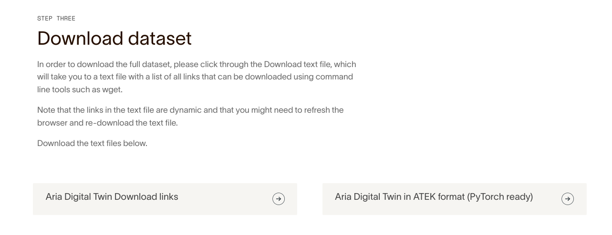

# ATEK Data Store

We preprocessed open Aria datasets with selected preprocessing configurations,
where users can directly download and load into PyTorch.

## List of available ATEK datasets

| Aria Open Dataset        | Preprocess configuration | Download link                                            |
| ------------------------ | ------------------------ | -------------------------------------------------------- |
| AriaDigitalTwin          | cubercnn                 | [access link](https://www.projectaria.com/datasets/adt/) |
| AriaDigitalTwin          | efm                      | [access link](https://www.projectaria.com/datasets/adt/) |
| AriaSyntheticEnvironment | cubercnn                 | [access link](https://www.projectaria.com/datasets/ase/) |
| AriaSyntheticEnvironment | cubercnn_eval            | [access link](https://www.projectaria.com/datasets/ase/) |
| AriaSyntheticEnvironment | efm                      | [access link](https://www.projectaria.com/datasets/ase/) |
| AriaSyntheticEnvironment | efm_eval                 | [access link](https://www.projectaria.com/datasets/ase/) |

Details of each preprocessing configuration are listed [here](TODO).

## How to access ATEK data

1.  First, make sure that you have followed the [Install.md](./Install.md) guide
    to install the **core** version of ATEK library, and cloned ATEK repo
    locally, e.g. to `${ATEK_SRC}`.
2.  Click **access link** in the above table, you can find the **Access The
    Dataset** button on the bottom of the page. Input your email address, you
    will be redirected to a page where you will find a button to download **...
    in ATEK format (PyTorch ready)** data.

    

3.  This will download a json file, e.g.
    `AriaDigitalTwin_ATEK_download_urls.json`, that contains the URLs of the
    actual preprocessed data. Note that for the same dataset, all preprocessing
    configuration's URLs are contained in the same json file.

4.  User now have 2 options to access the data, using ATEK-provided downloader
    script:

    a. **Optiona 1**: user can download the files to local:

    ```
    python3 ${ATEK_SRC}/tools/atek_wds_data_downloader.py \
     --config-name ${config_name} \
     --input-json-path ${downloaded_url_json} \
     --output-folder-path ${output_folder} \
     --max-num-sequences 10  \
     --train-val-split-ratio 0.8 \
     --random-seed 42 \
     --download-wds-to-local
    ```

    where :

    - `--config-name` specifies which [preprocessing configuration](TODO) you
      would like to download.
    - `--max-num-sequences` specifies number of sequences to download, and you
      can use `--random-seed` to get a determined list of sequences to download.
    - `--download-wds-to-local` this flag **needs to be set** to download to
      local.

    This command will download ATEK preprocessed WebDataset files with the
    following folder structure, where `local_*_tars.yaml` file can be loaded by
    [this API](TODO: add). Note that if the download breaks in the middle,
    simply run it again **with the same random seed (default 42)** to pick up
    from the middle.

    ```
    ./downloaded_local_wds
    ├── 0
    │   ├── shards-0000.tar
    │   ├── shards-0001.tar
    │   └── shards-0002.tar
    ├── 1
    │   ├── shards-0000.tar
    │   └── shards-0001.tar
    ├── ...
    ├── local_all_tars.yaml
    ├── local_train_tars.yaml
    └── local_validation_tars.yaml
    ```

    a. **Optiona 2**: user can also create 3 streamable yaml files, by using the
    same command but **without** the `--download-wds-to-local` flag. The created
    `streamable_*_tars.yaml` files can be loaded by [this API](TODO: add), where
    the preprocessed data can be streamed through web protocols via WebDataset
    library. See
    [ATEK_Demo_2](../examples/v3_demo_2_data_store_and_inference.ipynb) for an
    example.

The streaming option will be impacted by internet connections, hence we
**strongly recommend** users to use Option 1 to download the preprocessed data
in model training.
