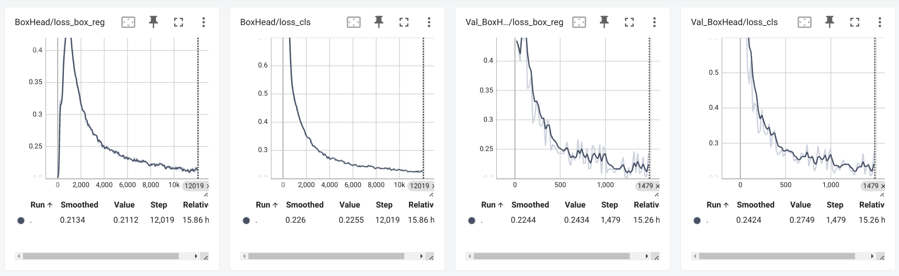

# Example: model training with CubeRCNN model

In this document, we will give an example of training a CubeRCNN model on ATEK preprocessed Aria data.

## Step 1: Install dependencies

To run this CubeRCNN example, user will need to follow [Install.md](./Install.md#optional-install-dependencies-for-running-cubercnn-examples) to install full dependencies for ATEK demos.

## Step 2: Download training data and model weights

First, download a pre-trained weights [`omni3d/cubercnn_DLA34_FPN.pth`](https://dl.fbaipublicfiles.com/cubercnn/omni3d/cubercnn_DLA34_FPN.pth) from CubeRCNN's Model zoo. We will finetune this model weight on Aria dataset.

Then, download preprocessed data from [ATEK Data Store](./ATEK_Data_Store.md#list-of-available-atek-datasets) to local, choose `AriaSyntheticEnvironment` and `cubercnn` configuration when downloading. This large dataset contains 10K preprocessed sequences, but user can start with a small test set by setting `--max-num-sequences` when running `atek_wds_data_downloader.py`:

```
python3 ./tools/atek_wds_data_downloader.py \
  --config-name cubercnn \
  --input-json-path ${downloaded_url_json} \
  --output-folder-path ./training_output/ \
  --train-val-split-json-path ./examples/data/ase_train_val_split.json \
  --download-wds-to-local
```

## Step 3: perform model training

User can now use the example training script we provided, [`train_cubercnn.py`](../tools/train_cubercnn.py), to train a CubeRCNN model on ASE dataset.

### Single-node, Multi-GPU

```
python ./tools/train_cubercnn.py \
  --config-file ./example/data/cubercnn_train_config_mini_example.yaml \
  --num-gpus $NUM_GPUS \
  OUTPUT_DIR ./training_output/ \
  TRAIN_LIST ./training_output/local_train_tars.yaml \
  TEST_LIST ./training_output/local_validation_tars.yaml \
  CATEGORY_JSON ./data/atek_id_to_name.json \
  ID_MAP_JSON ./data/atek_name_to_id.json \
  MODEL.WEIGHTS_PRETRAIN ./cubercnn_DLA34_FPN.pth \
  SOLVER.IMS_PER_BATCH 64
```

where:

- `MODEL.WEIGHTS_PRETRAIN` should be set to the downloaded pretrained model weights from Step 2.
- `SOLVER.IMS_PER_BATCH` is the total batch size for all GPUs. e.g. 4 GPUs with per-GPU batch of 32 gives IMS_PER_BATCH = 128.

### Multi-node, Multi-GPU on AWS

1. Reserve multiple nodes on AWS.
2. Choose one node as the head machine, and obtain the IP address by running:

  ```
  hostname --ip-address
  ```

3. For each node, set `$HEAD_NODE_IP` to the head node's IP, and set a common `$PORT` value e.g. (52111). Set `$RANK` to 0, 1, 2, ... for each node separately.

4. Run the example training script:

  ```
  python ./tools/train_cubercnn.py \
  --config-file ./example/data/cubercnn_train_config_mini_example.yaml \
  --num-gpus $NUM_GPUS \
  --num-machnes $NUM_NODES \
  --machine-rank $RANK \
  --dist-url tcp://$HEAD_NODE_IP:$PORT \
  OUTPUT_DIR ./training_output/ \
  TRAIN_LIST ./training_output/local_train_tars.yaml \
  TEST_LIST ./training_output/local_validation_tars.yaml \
  CATEGORY_JSON ./data/atek_id_to_name.json \
  ID_MAP_JSON ./data/atek_name_to_id.json \
  MODEL.WEIGHTS_PRETRAIN ./cubercnn_DLA34_FPN.pth \
  SOLVER.IMS_PER_BATCH 256
  ```

## Step 4: Check training progress on Tensorboards

During training, user can check the training progress on Tensorboard by running:

```
tensorboard --logdir=${WORKDIR}/mini_test_long --port 6007 --samples_per_plugin=images=1000
```

Here is the tensorboard results for ASE trained results, where the left 2 figures shows training loss, and the right 2 figures are validation loss: 

## Check final results and example trained weights

Once model training is finished, user can proceed to [example_inference.md] to run model inference on the trained weights.

We also provided 2 sets of CubeRCNN trained weights by us, one on ASE 10K dataset, the other on ADT dataset. The weights can be downloaded [here](https://www.projectaria.com/async/sample/download/?bucket=adt&filename=ATEK_example_model_weights.tar)
