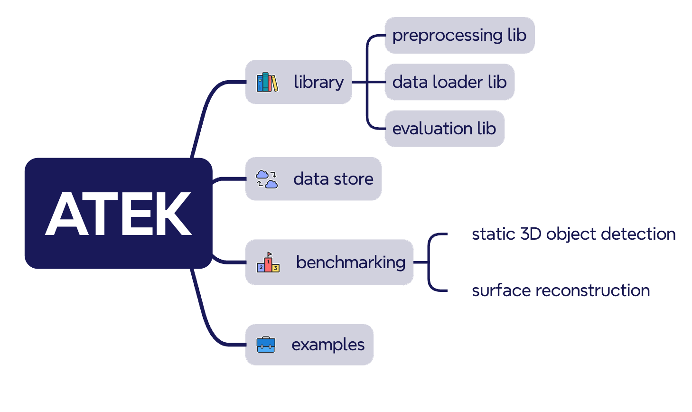
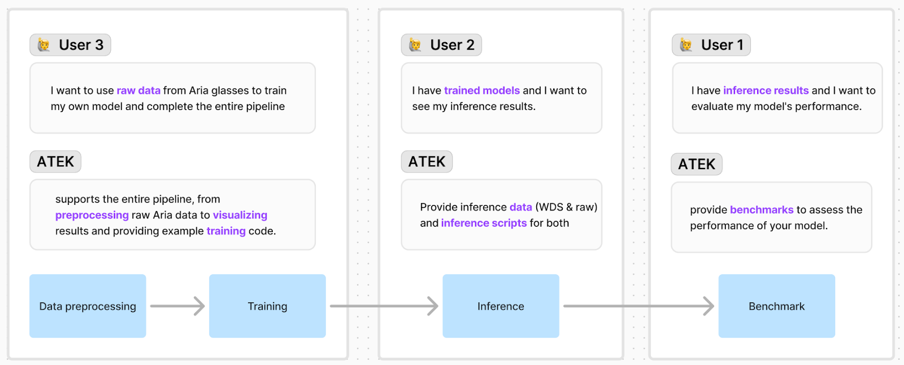

# Aria Training and Evaluation toolkit (ATEK)

<video width="800" controls autoplay muted>
  <source src="./docs/images/atek_github_video_small.mp4" type="video/mp4">
  Your browser does not support the video tag.
</video>

The Aria Training and Evaluation Kit (ATEK) is a toolbox for accelerating the development of Machine Learning tasks using Aria datasets. Specifically, it provides

- An easy-to-use data preprocessing library for Aria datasets for converting VRS-format Aria datasets in to datasets in PyTorch-compatible format
- Datastore of preprocessed data sets in WebDataset format
- Standardized evaluation libraries that supports the following ML perception tasks for Aria:
  - static 3D object detection
  - 3D surface reconstruction
- Notebooks and script examples including model training, inference, and visualization

ATEK users can engage ATEK in their projects with 3 different starting points:

- Just want to run some evaluation, even on non-Aria data? Check out [ATEK evaluation libraries](http://./docs/evaluation.md)\!
- Want to try your trained-model on ego-centric Aria data? Just download processed data from our [Data Store](http://./docs/ATEK_Data_Store.md), and check out how to run [model inference](http://./docs/data_loading_and_inference.md)\!
- Now ready for the full ML adventure from raw Aria data? Check out our full [table of contents](#table-of-content)\!

## Interactive Python notebook playground (Google Colab)

User can start with our Google Colab notebook, which shows an example of running and evaluating a 3D object detection model called `CubeRCNN`, on an Aria Digital Twin data sequence, which involves data-preprocessing, model inference, and evaluation.

## Table of content

- [Installation](docs/Install.md)
- [ATEK Data Store](./docs/ATEK_Data_Store.md)
- Technical specifications

  - [Data Preprocessing](./docs/preprocessing.md)
  - [Data Loader for inference and training](./docs/data_loading_and_inference.md)
    - [Model Adaptors](./docs/ModelAdaptors.md)
  - [Evaluation](./docs/evaluation.md)

- [Machine Learning tasks supported by ATEK]
  - [static 3D object detection](./docs/ML_task_object_detection.md)
  - [3D surface reconstruction](./docs/ML_task_surface_recon.md)
- Examples

  - [Example: demo notebooks](./docs/example_demos.md)
  - [Example: customization for SegmentAnything2 model](./docs/example_sam2_customization.md)
  - [Example: customization for CubeRCNN model](./docs/example_cubercnn_customization.md)
  - [Example: CubeRCNN model training](./docs/example_training.md)

## License

